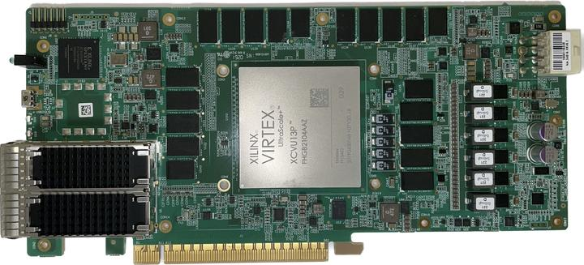

# alivu13p

Board support for the **ALIVU13P** — ex-datacenter accelerator card built
around the AMD/Xilinx Virtex UltraScale+ **XCVU13P** (`xcvu13p-fhgb2104-2L-e`).

The card is available second-hand, and undocumented. This repository
brings it up on a current toolchain and keeps an honest record of which interfaces have
actually been proven to work, with the evidence attached.




**Start at [STATUS.md](STATUS.md).** Every interface, its state, what was observed, and
when.

## What the board has

| | |
|---|---|
| FPGA | XCVU13P, 4 SLRs, `fhgb2104` package, speed grade `-2L-e` |
| Host interface | PCIe Gen3 x16 edge connector |
| Memory | 4 independent DDR4 channels, 16 GB total |
| Network | 2× QSFP28 cages (GTY bank 233 and bank 229) |
| Config | QSPI flash, JTAG header |
| Indicators | 8 user LEDs, 2 bicolour cage LEDs, a PCIe link LED |

## Layout

```
designs/     FPGA designs, one directory per interface under test
common/      shared Vivado makefile, for designs that build on upstream Verilog libraries
xdc/         board constraints, established by measurement
host/        host-side software: bring-up script, Python package, pytest suite
docs/        toolchain notes, PCIe bring-up, measured board facts
third_party/ external dependencies (submodules)
```

## Requirements

- **Vivado 2025.2.** The build system takes `vivado` from `PATH` — override with
  `make VIVADO=/path/to/vivado`.
- **Linux host** for the PCIe work. The Xilinx XDMA driver in `third_party/` builds
  unpatched on kernel 6.8 — current upstream already carries the guards that older
  advice says you have to add.
- **Python 3** and `pytest` for the host tests. Nothing else; the package under
  `host/alivu13p/` has no dependencies.

## Designs

| Design | What it proves |
|---|---|
| `designs/00_clk_probe` | Which candidate reference clocks actually have an oscillator behind them — twelve measured at once, four of them known-state controls |
| `designs/01_golden_pcie` | PCIe Gen3 x16: host enumeration, DMA to block RAM and to UltraRAM, register access, interrupts, and JTAG over the PCIe link |
| `designs/02_ddr4_cal` | All four DDR4 channels calibrate and store data, with no host involved |
| `designs/03_qsfp_ibert` | QSFP28 physical path — per-lane link, eye scan and BER across both cages, in Hardware Manager |
| `designs/04_pcie_ddr4` | PCIe DMA straight into 4 GiB of ECC DDR4 — the full aperture written and verified from the host |
| `designs/05_pcie_stream` | PCIe AXI-Stream: packet boundaries, byte-valid masks and backpressure, with no memory in the path |
| `designs/06_board_mgmt` | What the board *is*: the configuration flash's JEDEC ID, and each QSFP module's SFF-8636 identity over I2C |

Each has its own README explaining what it tests and how to read the result. See
[STATUS.md](STATUS.md) for which have been run on hardware.

## Prebuilt bitstreams

Every design's `.bit` is published on the [releases
page](https://github.com/JutsFunFor/alivu13p/releases), so the board can be tried without
installing Vivado. Each release's notes are generated from the artifacts themselves --
top module, exact part, build time and tool version read out of the bitstream header,
timing numbers from that build's report -- and `SHA256SUMS` covers every file.

```sh
vivado -mode batch -source tools/jtag_scan.tcl        # find the target string
vivado -mode batch -source tools/program.tcl -tclargs <target> 01_golden_pcie.bit
python3 tools/bitstream_info.py 01_golden_pcie.bit    # what the file says it is
```

They are not in git: a bitstream is a build output, it is tens of megabytes, it changes
on every rebuild, and no one can review it. `tools/release.py` builds a release from
whatever is currently built, and refuses to publish one that is older than a source file
it was built from.

## Constraints are checked, not trusted

A pin constraint is a claim about how the board is wired, and a wrong claim does not fail
the build — it produces a bitstream that implements cleanly, meets timing, and then does
not work. Since this board ships with no documentation, every assignment in `xdc/` is
checked mechanically against the device's own package database:

```bash
python3 xdc/tools/validate_pins.py xdc/
```

It catches pins that do not exist, a pin claimed by two different ports, a bank asked to
be two voltages at once, a mis-paired differential half, and a transceiver lane whose RX
and TX land on different channels. It runs in CI on every change to `xdc/`, and needs no
Vivado installation. See [xdc/README.md](xdc/README.md).

## The PCIe gotcha that catches everyone

The host walks the PCIe bus once, at boot. A card configured over JTAG *afterwards* does
not exist as far as Linux is concerned — nothing is wrong with design. Either
rescan, or warm-reboot (**not** a power cycle, which wipes the FPGA), or flash the image
to QSPI so the card configures at power-on. See
[docs/pcie-bringup.md](docs/pcie-bringup.md).

## Licence

Apache-2.0 — see [LICENSE](LICENSE). External components keep their own licences and
their headers are left intact; see [THIRD-PARTY.md](THIRD-PARTY.md).
